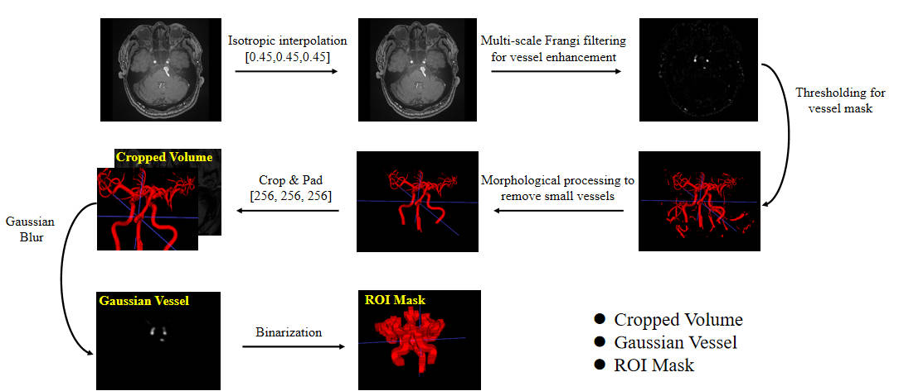
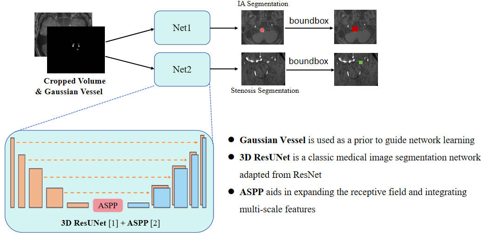
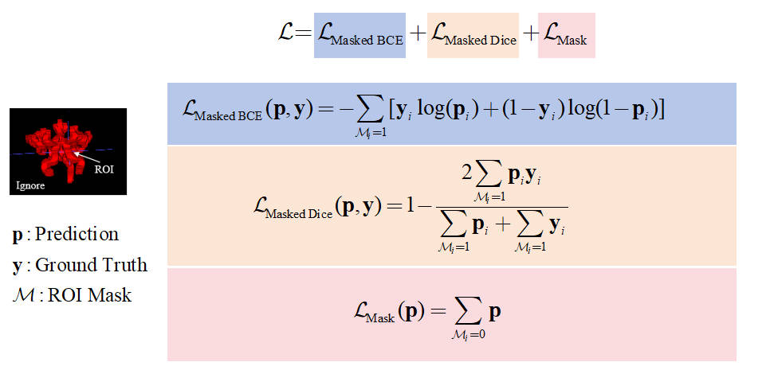

## 一、模型介绍
INSTED2024竞赛第三名解决方案（[访问比赛官网](https://www.codabench.org/competitions/2139/)
该方案采用ResUNet3D+ASPP网络来实现脑动脉瘤和脑动脉狭窄的检测和分割。预处理中通过多尺度Frangi滤波提前分割出血管所在区域，分割过程中，网络无需关注血管以外的背景，从而缓解样本不平衡问题。

## 二、文件结构说明

### 训练文件目录

- train/train.py: 单卡训练代码入口
- train/train_multi_gpu.py: 分布式训练代码入口
- train/train_dist.sh: 分布式训练脚本
- train/custom/dataset/dataset.py: dataset类
- train/custom/model/loss.py 模型loss
- train/custom/model/backbones/*.py 生成网络backbone
- train/custom/model/network.py: 网络整体框架
- train/custom/utils/*.py 训练相关工具函数
- train/config/model_config.py: 训练的配置文件

### 预测文件目录

* test/test_config.yaml: 预测配置文件
* test/main.py: 预测入口文件
* test/predictor.py: 模型预测具体实现，包括加载模型和后处理
* test/analysis_tools/*.py 结果分析工具函数，如计算评估指标

## 三、demo调用方法

1. 准备训练原始数据
   * 在train文件夹下新建train_data/origin_data文件夹，放入用于训练的原始dcm数据，分割标签
   * 运行 cd train & python custom/utils/generate_dataset.py，该命令将数据和标签打包成npz文件，作为网络dataset的输入，此步骤主要用于提高数据加载的io效率

2. 开始训练
   * 训练相关的参数，全部在train/custom/config/model_config.py 文件中
   * 分布式训练命令：sh ./train_dist.sh
   * 单卡训练命令：python train.py
   * 训练时，每隔指定epoch会输出训练过程中的损失以及验证集指标变化情况，自动保存在train/Logs下，其中 sample/ 目录下存有验证集的检测结果，为.nii.gz格式。tf_logs/ 目录下存有训练的tensorboard日志文件，通过 tensorborad --logdir tf_logs/ --port=6003 进行查看。backup.tar文件为训练时自动备份的当前代码，供有需要时查看和复原，复原命令: python custom/utils/version_checkout.py

3. 准备测试数据
   * 将待预测的dcm数据放入test/data/input目录下，labels放在test/data目录下

4. 开始预测
   * cd test
   * python main.py

5. 结果评估
   * python test/analysis_tools/cal_matrics.py
